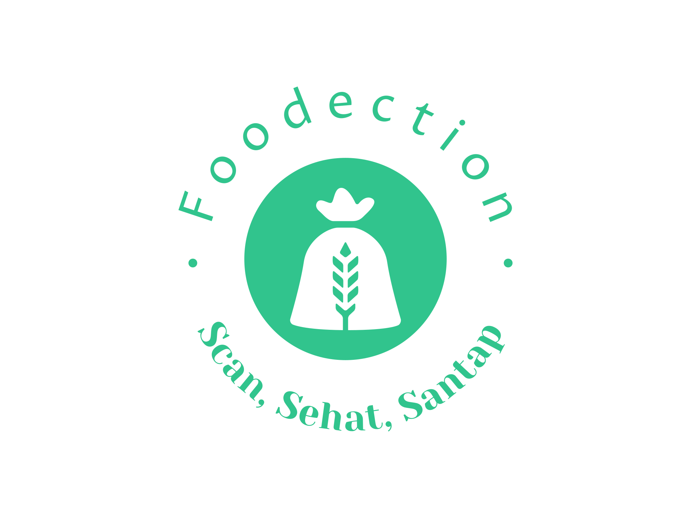

# Bangkit 2023 Batch 2 Capstone Team : CH2-PS364

Hello everyone!. Here is our repository for Bangkit 2023 Capstone project. Our team consist of 3 Machine Learning, 2 Mobile Development, and 2 Cloud Computing.

# This is Foodection Repository
Foodection is an application designed to solve the problem of food waste on an ongoing basis. which can detect the freshness of food raw materials, which is expected to not only help users to choose food that is truly fresh so that it will reduce the possibility of food waste.

# Made By 
|  No |             Name                  |        Path        |                  University                         |
| --- | --------------------------------- | ------------------ | --------------------------------------------------- |
| 1   | Syafirna Miftahul Jannah          | Machine Learning   | Universitas Muhammadiyah Riau                       |
| 2   | Hilda Zaqya Elnaz Putri           | Machine Learning   | UIN Maulana Malik Ibrahim Malang                    |
| 3   | Aline Sellwi Apriani              | Machine Learning   | Universitas Muhammadiyah Riau                       |
| 4   | Rayhan Syahputra                  | Cloud Computing    | Universitas Muhammadiyah Riau                       |
| 5   | Damar Adji Sodikin                | Cloud Computing    | Sekolah Tinggi Ilmu Manajemen dan Ilmu Komputer ESQ |
| 6   | Muhammad Al Misri Hidayat         | Mobile Development | Universitas Negeri Makassar                         |
| 7   | Ahmad Qurniawan                   | Mobile Development | Universitas Ahmad Dahlan                            |

## Machine Learning
Lorem Ipsum

## Cloud Computing
Lorem Ipsum

## Mobile Development
Lorem Ipsum
